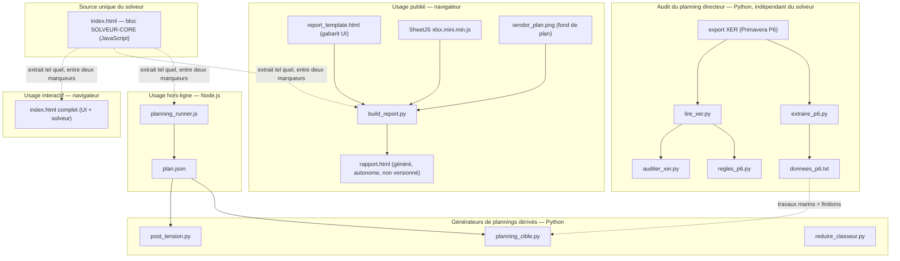
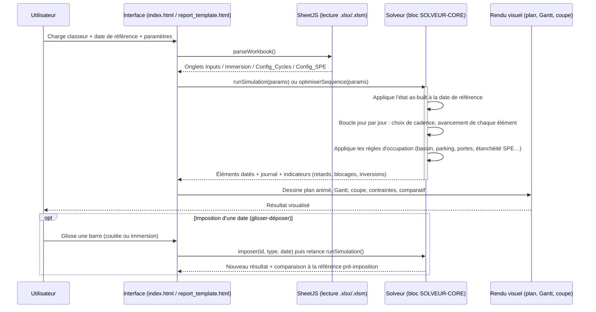
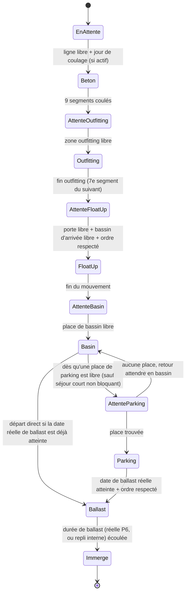

# 3. Architecture générale

## 3.1 Vue d'ensemble

Le projet n'a **pas d'architecture client/serveur** : c'est un ensemble de fichiers
statiques et de scripts hors-ligne, sans base de données, sans API, sans processus
serveur permanent. Trois familles de composants cohabitent dans le même dépôt :

1. **Le solveur**, un moteur de calcul et de simulation en JavaScript, qui n'existe
   qu'en un seul exemplaire de code source mais s'exécute dans trois contextes
   différents (navigateur interactif, page de restitution publiée, ligne de
   commande Node.js).
2. **Les générateurs de plannings dérivés**, des scripts Python hors-ligne qui
   consomment la sortie du solveur (au format JSON) pour produire des fichiers
   Excel dans des formats attendus par le chantier ou par des sous-traitants.
3. **La boîte à outils d'audit du planning directeur (P6)**, des scripts Python
   totalement indépendants du solveur, qui lisent directement un export XER de
   Primavera P6.

Un classeur Excel (`.xlsx`/`.xlsm`) est l'unique donnée d'entrée du solveur, dans les
trois contextes d'exécution. Un export XER de Primavera P6 est l'unique donnée
d'entrée de la boîte à outils d'audit. Les deux familles ne communiquent pas
directement : `extraire_p6.py` fait le pont, mais seulement pour des données
d'habillage (travaux marins, finitions) que le solveur ne calcule pas lui-même —
jamais pour des données qui entrent dans le calcul de cadence.

## 3.2 Composants

### `index.html` — l'outil complet, à double titre

Fichier unique (~4000 lignes), qui joue deux rôles :

- C'est **la page que l'utilisateur ouvre en développement/usage direct** : une
  interface complète en 6 étapes (image de fond, classeur, date de référence,
  durées, séquence/optimiseur, règles du modèle), avec la visualisation animée du
  plan du site.
- C'est **la seule implémentation existante du solveur**. Le code du moteur de
  calcul est isolé entre deux marqueurs de commentaire,
  `/* ==== SOLVEUR-CORE-DEBUT ==== */` et `/* ==== SOLVEUR-CORE-FIN ==== */`
  (lignes 355 à 3168 du fichier à la date de ce dossier). Tout ce qui est en
  dehors de ces marqueurs est de l'habillage propre à `index.html`
  (chargement de fichiers, génération d'un classeur modèle, export CSV) et n'est
  **jamais** repris ailleurs.

Le bloc `SOLVEUR-CORE` est structuré en sections numérotées, commentées en tête de
chacune :

1. Géométrie du site (coordonnées relatives, en %, calées sur le plan
   d'installation générale)
1bis. Règles du modèle (`REGLES`, objet unique, réglable depuis l'interface)
1ter. Vacances (arrêts annuels)
2. Configuration par défaut (reprise des valeurs par défaut de la macro VBA d'origine)
3. Utilitaires de date
4. État global (variables du moteur)
5. Lecture des feuilles du classeur
7. Moteur de cycle (durée d'outfitting pour un rythme donné)
7bis. Analyseur de statut as-built
8. Solveur de cadence + simulation jour par jour
8bis. Optimiseur de séquence de production
9. Rendu visuel (SVG du plan et de la coupe)
10. Impositions manuelles (dates pilotes)

*(La numérotation n'est pas continue à dessein : elle a été conservée telle que le
projet l'a fait évoluer, plutôt que renumérotée à chaque ajout — un choix qui a un
coût de lisibilité, discuté dans `13_audit_critique.md`.)*

### `report_template.html` + `build_report.py` → `rapport.html`

`report_template.html` est un **gabarit** : une page HTML/CSS/JS complète mais avec
deux jetons de substitution, `/*__SOLVEUR__*/` et `/*__XLSX__*/`, et un troisième
optionnel pour l'image de fond (`/*__PLAN__*/ null`). `build_report.py` :

1. extrait le bloc `SOLVEUR-CORE` de `index.html` ;
2. charge une copie du moteur de lecture Excel SheetJS (`xlsx.mini.min.js`),
   trouvée localement (`vendor/` ou `node_modules/`) ou téléchargée depuis un CDN
   à défaut ;
3. encode en Base64 l'image de fond du plan (`vendor_plan.png`) si présente ;
4. remplace les trois jetons dans le gabarit et écrit `rapport.html`.

Le résultat est une page **totalement autonome** (aucune requête réseau à
l'exécution), publiable telle quelle (chez ce projet : publiée comme artefact
partagé). Le fichier `rapport.html` **n'est pas versionné** (il figure dans
`.gitignore`) : c'est un artefact de build, reconstruit à la demande, jamais édité
à la main.

`report_template.html` ajoute, par rapport à `index.html`, des fonctionnalités
propres à la restitution : rapport de « conséquences » d'une imposition, barres de
Gantt déplaçables (glisser-déposer), relevé exhaustif des contraintes, comparatif
de séquences visuel, planning imprimable, avancement des finitions, tracé des flux
de circulation d'un élément entre ressources. Ces fonctionnalités consomment le
même moteur de solveur mais ne font pas partie du bloc `SOLVEUR-CORE` — elles
restent propres à cette page.

### `planning_runner.js` — exécution en ligne de commande

Recharge le même bloc `SOLVEUR-CORE` dans un bac à sable Node.js (module `vm`), y
injecte le classeur (lu par le paquet npm `xlsx`), exécute
`parseWorkbook` → `optimiserSequence`/`runSimulation`, puis écrit sur la sortie
standard un JSON décrivant, pour chaque élément, l'intégralité de ses dates de
phase et les indicateurs globaux (retards, blocages, changements de cadence).

Ce composant existe pour deux raisons : permettre l'exécution de tests automatisés
hors navigateur, et alimenter les générateurs de plannings dérivés
(`post_tension.py`, `planning_cible.py`) avec le **même** résultat que celui
affiché à l'écran — les paramètres par défaut de `planning_runner.js` sont
délibérément synchronisés avec ceux de `report_template.html` pour cette raison
(un défaut de synchronisation a été corrigé en cours de projet, voir
`04_journal_decisions_ADR.md`, ADR-018).

### Générateurs de plannings dérivés (Python)

- **`post_tension.py`** lit le JSON de `planning_runner.js` et produit un
  classeur Excel de planning de post-tension, au format visuel du modèle fourni
  par le sous-traitant Dywidag (un Gantt classique : une ligne par élément, dates
  début/fin par opération — enfilage, mise en tension, injection —, numéros
  d'éléments en clair, plus un graphique en barres empilées).
- **`planning_cible.py`** transforme ce même JSON en planning d'occupation du
  site au format *Target schedule* utilisé sur le chantier (une ligne par
  ressource, une colonne par demi-semaine), en y intégrant en option les travaux
  marins et les finitions extraits du planning P6 par `extraire_p6.py`.
- **`reduire_classeur.py`** produit, à partir du classeur d'entrée complet, une
  copie réduite aux seules feuilles/colonnes/lignes que le solveur lit
  effectivement — un outil de documentation autant que de simplification.

### Boîte à outils d'audit du planning directeur (Python, indépendante du solveur)

- **`lire_xer.py`** : lecteur générique et économe en mémoire du format tabulé
  XER de Primavera P6 (tables `%T`, champs `%F`, enregistrements `%R`), tolérant
  aux champs mémo multi-lignes. Ne connaît rien du domaine métier du tunnel :
  c'est un parseur de format de fichier, réutilisable pour tout export XER.
- **`auditer_xer.py`** : audit de qualité du planning selon une grille inspirée
  de la méthode **DCMA-14** (14 points de contrôle de plannings, voir
  `11_glossaire.md` et `12_annexes.md`), plus des contrôles additionnels propres
  à ce projet (détection de calendriers dont la capacité horaire annuelle est
  identique mais la déclaration d'heures/jour diffère — indice d'une saisie
  incohérente).
- **`regles_p6.py`** : repère les motifs répétés dans les noms d'activités (un
  « rôle » d'activité, débarrassé du numéro d'élément qu'il porte), reconstruit
  l'ordre de pose à partir des dates d'immersion, et produit des statistiques de
  chaînage rôle par rôle — pour identifier, sans connaître a priori la logique du
  planificateur, quelles activités ou quels liens pourraient être resserrés sans
  rompre la logique du planning.
- **`extraire_p6.py`** : extrait du même export les activités récapitulatives de
  travaux marins et de finitions (lues au plus bas niveau de l'arborescence WBS),
  pour habiller le planning d'occupation généré par `planning_cible.py` — ces
  données n'entrent à aucun moment dans le calcul du solveur.

Cette boîte à outils est **volontairement indépendante** du solveur de cadence :
elle lit et décrit le planning P6, elle ne le modifie ni ne réinjecte
automatiquement ses constats dans les règles du solveur. Voir la discussion sur ce
choix dans `04_journal_decisions_ADR.md` (ADR-017) et son statut dans
`05_analyse_risques.md`.

## 3.3 Flux de données du calcul de cadence

## 3.4 Machine à états d'un élément standard (ligne PL)

Le cœur du solveur simule chaque élément comme une machine à états, avancée d'un
jour à la fois. Simplifié (la ligne SPE suit un cheminement distinct, à 7 zones,
non représenté ici) :

La date de ballast « réelle » est calculée **à rebours** depuis la date
d'immersion cible (donnée du planning P6) moins la durée réelle de ballast
(également une donnée du planning P6, propre à chaque élément) — c'est la règle
qui pilote la sortie du bassin et du parking, pas une durée forfaitaire ajoutée en
avant (voir ADR-016 dans `04_journal_decisions_ADR.md` pour l'historique d'un bug
corrigé sur ce point précis).

## 3.5 Choix technologiques

| Choix | Alternative(s) envisagée(s) et pourquoi elle(s) n'a/n'ont pas été retenue(s) |
|---|---|
| **JavaScript vanilla, sans framework**, exécuté dans le navigateur | Un framework (React, Vue…) aurait exigé une étape de build et une chaîne d'outils pour un usage « ouvrir le fichier et ça marche » — contraire à l'exigence de portabilité (`02_cahier_des_charges.md`). Le volume de logique d'interface reste raisonnable pour du DOM manipulé directement. |
| **SheetJS** pour la lecture Excel côté navigateur | Alternative : conversion préalable en CSV/JSON côté serveur — rejetée, car cela réintroduirait une étape serveur, contraire à la contrainte « aucune donnée envoyée à un tiers ». Le build « mini » de SheetJS est préféré au build « full » : celui-ci embarque des tables de pages de code obsolètes truffées de caractères de remplacement Unicode qui font échouer certains pipelines de publication de page. |
| **Extraction de code source entre marqueurs** (plutôt qu'un module JS partagé importé) pour dupliquer le solveur dans les 3 contextes d'exécution | Alternative naturelle : un module ES importé par les trois consommateurs. Non retenue à ce stade parce que `index.html` visait d'abord la simplicité de distribution (un seul fichier, sans étape de build pour l'usage interactif) ; l'extraction textuelle atteint la même garantie de source unique sans introduire de bundler. Voir `13_audit_critique.md` pour un regard critique sur ce compromis. |
| **Node.js + module `vm`** pour l'exécution hors navigateur | Alternative : réécrire le solveur en Python pour l'usage en ligne de commande — rejetée d'emblée, car cela aurait cassé la garantie de source unique du solveur (deux implémentations à maintenir en parallèle). |
| **Python + openpyxl** pour les générateurs de plannings dérivés et la boîte à outils d'audit | Alternative : tout faire en Node.js pour rester dans un seul langage — non retenue : openpyxl offre un contrôle fin de la mise en forme Excel (fusion de cellules, couleurs, graphiques) nécessaire pour reproduire fidèlement des gabarits Excel existants (Target schedule, modèle Dywidag), et ces scripts sont des outils d'analyse ponctuelle, pas des composants du calcul lui-même — le risque de duplication de logique métier ne s'applique pas à eux. |
| **Simulation gloutonne jour par jour**, plutôt qu'une résolution globale sous contraintes (programmation linéaire en nombres entiers, par exemple) | Un solveur de contraintes global aurait pu chercher un optimum théorique sur l'ensemble des ressources partagées simultanément. Non retenu : la taille de l'espace de décision (affectations de ligne × ordres × rythmes sur 89 éléments) est jugée disproportionnée par rapport au besoin (le cahier des charges du chantier demande un plan exploitable et vérifiable, pas un optimum mathématique prouvé), et une simulation gloutonne, plus lisible, permet d'expliquer *pourquoi* chaque décision est prise — exigence de traçabilité du projet. Limite assumée et documentée dans `README.md` (section « Limites connues ») et reprise dans `05_analyse_risques.md`. |
| **Publication du planning P6 en XER**, lu par un parseur maison, plutôt qu'un import direct dans un outil P6 tiers | Aucun accès à une licence Primavera P6 ou à son API n'était disponible dans le contexte de développement ; le format XER, texte tabulé documenté, est directement analysable sans dépendance logicielle propriétaire. |

## 3.6 Ce que l'architecture ne couvre pas

- Il n'existe **aucune persistance** au-delà du fichier Excel que l'utilisateur
  charge et, le cas échéant, réexporte : aucune base de données, aucun
  historique de calculs conservé automatiquement d'une session à l'autre.
- Il n'existe **aucune authentification ni gestion d'utilisateurs** : l'outil
  n'a pas de notion de compte, de rôle ou de droit d'accès (voir
  `06_documentation_technique.md`).
- Il n'existe **aucun mécanisme d'intégration continue** exécutant les tests à
  chaque modification (voir `05_analyse_risques.md`).
